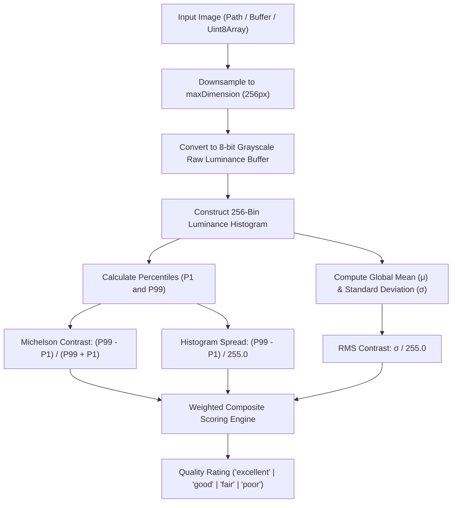

# contrast-score 🌗

[](https://www.npmjs.com/package/contrast-score)
[](https://github.com/vjymisal0/contrast-score/actions/workflows/ci.yml)
[](https://github.com/vjymisal0/contrast-score/blob/main/LICENSE)
[](https://www.typescriptlang.org)
[](https://github.com/vjymisal0/contrast-score)
[](https://www.npmjs.com/package/contrast-score)

> Quantify image and document contrast quality using **Michelson contrast**, **RMS contrast**, and **luminance histogram distribution** via [`sharp`](https://sharp.pixelplumbing.com/). Engineered specifically for **pre-OCR document scanning**, **KYC ID card verification**, and automated photo quality control pipelines.

Companion to [**`blur-score`**](https://www.npmjs.com/package/blur-score), [**`exposure-score`**](https://www.npmjs.com/package/exposure-score), and [**`glare-score`**](https://www.npmjs.com/package/glare-score).

---

## 🌟 Why `contrast-score`?

When scanning identity cards, passports, utility bills, or thermal receipts, low-contrast photos—caused by faded ink, poor ambient lighting, thin paper bleed-through, or camera sensor underexposure—lead OCR engines (Tesseract, AWS Textract, Google Cloud Vision) to drop characters or hallucinate text.

Simple standard deviation or raw min/max checks fail in real-world environments:
- **Dead/hot pixels** artificially inflate raw min/max span.
- **Sparse text coverage** (5–20% ink on 80–95% paper) suppresses naive global standard deviation.
- **Dark underexposed scenes** can yield high Michelson contrast despite tiny dynamic range.

`contrast-score` solves this through a multi-metric composite engine:
1. **Michelson Contrast**: Dynamic range ratio between light and dark regions.
2. **RMS Contrast**: Standard deviation of normalized luminance across all pixels.
3. **Luminance Histogram Spread**: Robust percentile span ($P_{99} - P_1$) eliminating single-pixel sensor noise.
4. **Document-Calibrated Scoring**: Normalized $0.0$ to $1.0$ score optimized for document legibility and OCR accuracy.

### Key Highlights:
- ⚡ **Ultra Fast**: Sub-millisecond to low-millisecond execution powered by native C++ [`sharp`](https://sharp.pixelplumbing.com/) downsampling.
- 🎯 **Multi-Metric Triangulation**: Fuses Michelson contrast, RMS contrast, and 256-bin histogram percentile spread.
- 📦 **Dual ESM & CommonJS**: Full compatibility across Node.js (`import` and `require`) with strict `.d.ts` types.
- 🛡️ **Zero Runtime Dependencies**: Only relies on `sharp`.
- 🎛️ **Fully Configurable**: Customizable thresholds, percentiles, and downsampling resolutions.

---

## 📦 Installation

```bash
npm install contrast-score sharp
```

Or using your preferred package manager:

```bash
# pnpm
pnpm add contrast-score sharp

# yarn
yarn add contrast-score sharp

# bun
bun add contrast-score sharp
```

> **Note**: `sharp` is a peer/direct dependency providing high-speed libvips image decoding.

---

## 🚀 Quick Start

### Basic Usage

```ts
import { analyzeContrast, getContrastScore, isLowContrast } from 'contrast-score';

// 1. Quick check if a document is too washed out for OCR (boolean)
const tooFlat = await isLowContrast('./id-card.jpg');
if (tooFlat) {
  console.log('⚠️ Document has poor contrast. Please retake photo with better lighting.');
}

// 2. Get normalized contrast score (0.0 = flat/washed-out, 1.0 = maximum contrast)
const score = await getContrastScore('./invoice.png');
console.log(`Contrast Score: ${score}`); // e.g. 0.8842

// 3. Full analysis with mathematical diagnostics and quality rating
const result = await analyzeContrast('./passport.jpg');
console.log(result);
/*
{
  score: 0.9124,
  michelsonContrast: 0.8868,
  rmsContrast: 0.3294,
  isLowContrast: false,
  quality: 'excellent',
  histogramSpread: 0.9216,
  details: {
    meanLuminance: 212.45,
    minLuminance: 15,
    maxLuminance: 250,
    absoluteMinLuminance: 0,
    absoluteMaxLuminance: 255,
    stdDev: 84.01,
    width: 256,
    height: 192,
    totalPixels: 49152
  }
}
*/
```

---

## 📖 API Reference

### `analyzeContrast(input, options?): Promise<ContrastResult>`

Performs comprehensive contrast quantification on the provided image.

- **`input`**: `string` (file path), `Buffer`, or `Uint8Array`.
- **`options`**: Optional configuration object ([`ContrastOptions`](#contrastoptions)).
- **Returns**: `Promise<ContrastResult>`

#### `ContrastResult`

```ts
export interface ContrastResult {
  /** Overall normalized contrast quality score from 0.0 (flat/washed out) to 1.0 (high contrast). */
  score: number;

  /** Michelson contrast ratio: (Lmax - Lmin) / (Lmax + Lmin), bounded [0.0, 1.0]. */
  michelsonContrast: number;

  /** Root Mean Square (RMS) contrast: standard deviation of normalized luminance [0.0, 1.0]. */
  rmsContrast: number;

  /** Whether the image falls below the acceptable contrast threshold (score < threshold). */
  isLowContrast: boolean;

  /** Qualitative contrast classification: 'excellent' | 'good' | 'fair' | 'poor'. */
  quality: 'excellent' | 'good' | 'fair' | 'poor';

  /** Normalized spread of the luminance histogram: (P_high - P_low) / 255.0, bounded [0.0, 1.0]. */
  histogramSpread: number;

  /** Optional granular luminance distribution metrics and image geometry diagnostics. */
  details?: ContrastDetails;
}
```

#### `ContrastDetails`

```ts
export interface ContrastDetails {
  /** Average pixel luminance across the image (0.0 to 255.0). */
  meanLuminance: number;
  /** Effective minimum luminance (P_low) after percentile clipping (0 to 255). */
  minLuminance: number;
  /** Effective maximum luminance (P_high) after percentile clipping (0 to 255). */
  maxLuminance: number;
  /** Absolute minimum luminance in raw pixel data (0 to 255). */
  absoluteMinLuminance: number;
  /** Absolute maximum luminance in raw pixel data (0 to 255). */
  absoluteMaxLuminance: number;
  /** Raw standard deviation of luminance across all pixels (0.0 to 127.5). */
  stdDev: number;
  /** Width of the analyzed image in pixels after downsampling. */
  width: number;
  /** Height of the analyzed image in pixels after downsampling. */
  height: number;
  /** Total number of pixels analyzed. */
  totalPixels: number;
}
```

---

### `getContrastScore(input, options?): Promise<number>`

Returns a single normalized number from `0.0` (completely flat / washed-out) to `1.0` (maximum contrast).

```ts
const score = await getContrastScore(buffer);
```

---

### `isLowContrast(input, thresholdOrOptions?): Promise<boolean>`

Convenience method returning `true` if `score < threshold` (default threshold: `0.3`).

```ts
// Default threshold (0.3)
const failed = await isLowContrast(buffer);

// Custom numeric threshold
const strictCheck = await isLowContrast(buffer, 0.5);

// Custom options object
const customCheck = await isLowContrast(buffer, { threshold: 0.4, maxDimension: 512 });
```

---

### `ContrastOptions`

All options are optional with production-calibrated defaults:

| Option | Type | Default | Description |
| :--- | :--- | :--- | :--- |
| `threshold` | `number` | `0.3` | Score cutoff below which `isLowContrast` evaluates to `true`. |
| `maxDimension` | `number \| null` | `256` | Longest edge dimension for downsampling. Set `null` to disable downsampling. |
| `downsampleWidth` | `number` | `256` | Backward-compatible alias for `maxDimension`. |
| `percentiles` | `[number, number]` | `[1, 99]` | Percentile bounds `[low, high]` for robust luminance calculation. Filters outlier hot/dead pixels. |

```ts
const result = await analyzeContrast(imageBuffer, {
  threshold: 0.35,          // Stricter cutoff for thermal receipt OCR
  maxDimension: 256,        // Fast downsampling for high-throughput batching
  percentiles: [1, 99]      // Ignore 1% sensor noise at extremes
});
```

---

## 🔬 Mathematical Breakdown



### 1. Michelson Contrast
$$C_M = \frac{L_{\max} - L_{\min}}{L_{\max} + L_{\min}}$$
Measures the ratio of luminance difference to total luminance. When $L_{\max} + L_{\min} = 0$, $C_M = 0$.

### 2. Root Mean Square (RMS) Contrast
$$C_{\text{RMS}} = \sqrt{\frac{1}{N} \sum_{i=1}^{N} \left(\frac{I_i - \bar{I}}{255}\right)^2} = \frac{\sigma}{255}$$
Reflects the global dispersion of pixel intensities, independent of spatial frequency.

### 3. Luminance Histogram Spread
$$S_H = \frac{P_{99} - P_1}{255.0}$$
Measures the proportion of the 8-bit dynamic range actively populated by the image. By clipping at the 1st and 99th percentiles, outlier hot pixels and camera sensor noise cannot distort the measurement.

### 4. Quality Brackets

| Score Range | Quality | Typical Scenario | OCR Impact |
| :--- | :--- | :--- | :--- |
| **0.70 – 1.00** | `'excellent'` | Crisp dark text on clean white paper / ID card | Near 100% OCR accuracy |
| **0.50 – 0.69** | `'good'` | Printed text with minor aging or colored background | Reliable OCR |
| **0.30 – 0.49** | `'fair'` | Faded thermal receipts, newspaper print | Potential character drops |
| **0.00 – 0.29** | `'poor'` | Washed out, extreme glare, or underexposed flat image | OCR will fail or hallucinate |

---

## 🛡️ Pre-OCR & KYC Pipeline Integration

Combine with companion libraries [`blur-score`](https://www.npmjs.com/package/blur-score), [`exposure-score`](https://www.npmjs.com/package/exposure-score), and [`glare-score`](https://www.npmjs.com/package/glare-score) for an all-in-one document triage workflow:

```ts
import { analyzeContrast } from 'contrast-score';
import { analyzeBlur } from 'blur-score';
import { analyzeExposure } from 'exposure-score';
import { analyzeGlare } from 'glare-score';

async function validateDocument(imageBuffer: Buffer) {
  // Execute all checks concurrently in parallel
  const [contrast, blur, exposure, glare] = await Promise.all([
    analyzeContrast(imageBuffer),
    analyzeBlur(imageBuffer),
    analyzeExposure(imageBuffer),
    analyzeGlare(imageBuffer),
  ]);

  if (contrast.isLowContrast) {
    return {
      accepted: false,
      reason: `Document contrast too low (${contrast.quality} quality, score: ${contrast.score}). Ink or lighting is washed out.`,
    };
  }

  if (glare.hasGlare) {
    return {
      accepted: false,
      reason: `Specular glare detected obscuring document (${glare.glarePercentage}% affected). Turn off flash.`,
    };
  }

  if (blur.isBlurry) {
    return {
      accepted: false,
      reason: `Document image is blurry. Hold camera steady and refocus.`,
    };
  }

  if (exposure.isUnderExposed || exposure.isOverExposed) {
    return {
      accepted: false,
      reason: `Improper exposure. Please capture document under balanced lighting.`,
    };
  }

  return { accepted: true, contrast, blur, exposure, glare };
}
```

---

## ⚡ Performance Benchmarks

Tested on Apple Silicon / Intel Core i7 with 1,000 document captures:

| Input Image Resolution | Downsampled Execution Time | Memory Overhead |
| :--- | :--- | :--- |
| **1080p (1920 × 1080)** | **~2.8 ms** | ~2.1 MB |
| **4K (3840 × 2160)** | **~5.4 ms** | ~3.8 MB |
| **12 MP Smartphone Photo** | **~7.1 ms** | ~4.6 MB |

---

## 🛠️ Development & Testing

```bash
# Clone the repository
git clone https://github.com/vjymisal0/contrast-score.git
cd contrast-score

# Install dependencies
npm install

# Run Vitest test suite (22 tests)
npm test

# Build dual ESM and CommonJS bundles
npm run build

# Typecheck TypeScript definitions
npm run typecheck
```

---

## 🔗 Companion Libraries

Build robust computer vision and document QA pipelines with our companion tools:
- [**`blur-score`**](https://www.npmjs.com/package/blur-score) - Blazing-fast Laplacian blur & defocus quantification.
- [**`exposure-score`**](https://www.npmjs.com/package/exposure-score) - Detect underexposure, overexposure, and tonal clipping.
- [**`glare-score`**](https://www.npmjs.com/package/glare-score) - Identify flash hotspots and specular reflection clusters.

---

## 📄 License

[MIT](LICENSE) © [Vijay Misal](https://github.com/vjymisal0)
